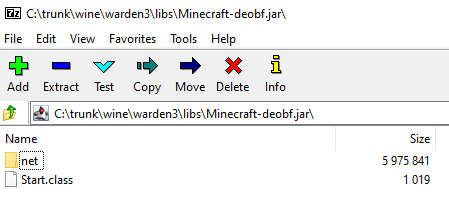
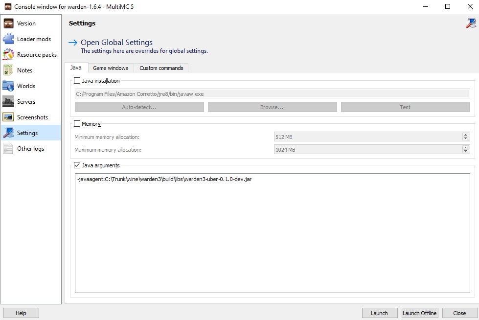

# 

Warden³ is an open-source continuation of Warden² (now discontinued), it will remain free and
open-source in-definitively. There are absolutely no (and never will be) any promises of compatibility
nor reliability. Take this software as is; if you have any problems feel free to either make a pull request
or an issue, but keep in mind that this is an open-source, non-profit hobby project, and your issue is not
guaranteed to be fixed.

## Requirements
- [Java development kit 15](https://adoptopenjdk.net/?variant=openjdk15)
- [Mod coder pack for 1.6.4](https://minecraft.gamepedia.com/Programs_and_editors/Mod_Coder_Pack#Downloads)
- [Minecraft 1.6.4](https://minecraft.net)
- [MultiMC](https://multimc.org)
- [Gradle](https://gradle.org)
- [Git](https://git-scm.com) (optional)

## Setup
* Decompile and recompile Minecraft using MCP
    * `decompile.bat` (Windows) or `./decompile.sh` (Linux/Mac)
    * `recompile.bat` (Windows) or `./recompile.sh` (Linux/Mac)
    * Create a zip archive with **all** the files under `MCP_DIRECTORY/bin/minecraft`
    * Rename said zip archive to `Minecraft-debof.jar`
    * Put the de-obfuscated Minecraft jar under `WARDEN_DIRECTORY/libs`, you should now have a jar that looks something like this:
    
* Build the project
    * `gradlew.bat build` (Windows) or `./gradlew build` (Linux/Mac)

## Usage
* Create a new MultiMC instance for version 1.6.4
* Edit the newly created instance
* Under version click "Replace Minecraft.jar" and select your de-obfuscated Minecraft jar
* Under settings turn on the "Java arguments" checkbox
  * Add the line `-javaagent:path/to/your/warden/uber.jar`, your settings page should now look like this:
  

That's it, you can now launch the game and Warden will be loaded.
